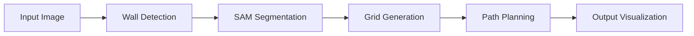

# 🧱 Wall Segmentation Pipeline

A powerful computer vision system that combines AI-powered wall segmentation with drone integration for automated wall analysis and path planning. This project enables real-time wall detection, segmentation, and navigation path generation using state-of-the-art deep learning models.

## ✨ Key Features

🤖 **AI-Powered Wall Detection** - Uses Segformer for semantic segmentation and SAM2 for precise wall boundaries  
🚁 **Drone Integration** - Full DJI Tello drone support with real-time image capture  
📊 **Interactive Web Interface** - Streamlit-based GUI with step-by-step processing visualization  
🎯 **Smart Point Selection** - Automatically identifies optimal wall points for analysis  
🗺️ **Path Planning** - Generates navigation grids and connection paths for autonomous movement  
🔧 **Flexible Processing** - Supports both uploaded images and live drone capture  

## 🚀 Quick Start

### Prerequisites

- Python 3.13+
- CUDA-compatible GPU (recommended)
- DJI Tello drone (optional)

### Installation

1. **Clone the repository**
   ```bash
   git clone <repository-url>
   cd wall-segmentation
   ```

2. **Install dependencies**
   ```bash
   pip install -r requirements.txt
   ```

3. **Download SAM2 model**
   - Place `sam2_t.pt` in the project root directory

4. **Run the application**
   ```bash
   streamlit run app.py
   ```

### 🐳 Docker Setup

```bash
# Build the container
docker build -t wall-segmentation .

# Run the application
docker run -p 8501:8501 wall-segmentation
```

Access the application at `http://localhost:8501`

## 🎮 How to Use

### 📷 Image Upload Mode
1. Upload an image using the file uploader
2. Adjust the GAP slider (30-100) for grid spacing
3. Watch the 4-step processing pipeline:
   - **Step 1**: Wall point detection
   - **Step 2**: SAM segmentation  
   - **Step 3**: Grid point generation
   - **Step 4**: Path connection

### 🚁 Drone Mode
1. Connect your DJI Tello drone
2. Monitor battery status and flight state
3. Configure distance and height parameters
4. Use drone controls:
   - **Take Off** 🚁 - Launch the drone
   - **Capture Image** 📸 - Position and capture wall image
   - **Land** 🛬 - Safely land the drone

## 🏗️ Architecture

### Core Components

```
📁 package/
├── pick_wall_point.py      # AI-powered wall detection
├── draw_result_on_image.py # Segmentation visualization
├── draw_points.py          # Grid generation
├── connect_points.py       # Path planning
├── distance_estimation.py  # Depth analysis
└── save_image.py          # Image utilities

📁 services/
└── drone.py               # DJI Tello integration

📁 data/
└── commands.csv           # Drone command sequences
```

### Processing Pipeline



## 🔧 Configuration

### Grid Spacing
- **GAP Parameter**: Controls the density of navigation points (30-100 pixels)
- Lower values = more detailed paths
- Higher values = faster processing

### Drone Settings
- **Distance from Wall**: 0.5-10 meters
- **Flight Height**: 1-5 meters
- **Battery Monitoring**: Automatic safety checks

## 📊 Output Examples

The system generates a complete visualization sequence:

1. **🖼️ Black & White Wall Mask** - Binary segmentation result
2. **🎯 Selected Wall Point** - Optimal analysis point highlighted
3. **📐 Wall Segmentation** - Precise boundary detection
4. **🧮 Grid Points** - Navigation waypoints overlay
5. **🛣️ Final Path** - Connected route for autonomous navigation

## 🛠️ Technical Stack

- **Deep Learning**: PyTorch, Ultralytics SAM, Transformers
- **Computer Vision**: OpenCV, PIL, scikit-image
- **Web Interface**: Streamlit
- **Drone Control**: djitellopy
- **Scientific Computing**: NumPy, SciPy
- **Visualization**: Matplotlib, Seaborn

## 📁 Project Structure

```
wall-segmentation/
├── 📄 app.py                 # Main Streamlit application
├── 📄 requirements.txt       # Python dependencies
├── 📄 Dockerfile            # Container configuration
├── 📁 package/              # Core processing modules
├── 📁 services/             # Drone integration
├── 📁 helpers/              # Utility functions
├── 📁 sample_input/         # Test images
├── 📁 demo/                 # Example outputs
├── 📁 assets/               # Demo images
└── 📁 output/               # Generated results
```

## 🤝 Contributing

1. Fork the repository
2. Create a feature branch (`git checkout -b feature/amazing-feature`)
3. Commit your changes (`git commit -m 'Add amazing feature'`)
4. Push to the branch (`git push origin feature/amazing-feature`)
5. Open a Pull Request

## 📝 License

This project is licensed under the MIT License - see the LICENSE file for details.

## 🙏 Acknowledgments

- **Ultralytics** for the SAM2 implementation
- **Hugging Face** for the Segformer models
- **DJI** for the Tello drone SDK
- **Streamlit** for the amazing web framework

---

**Built with ❤️ for autonomous navigation and computer vision research**